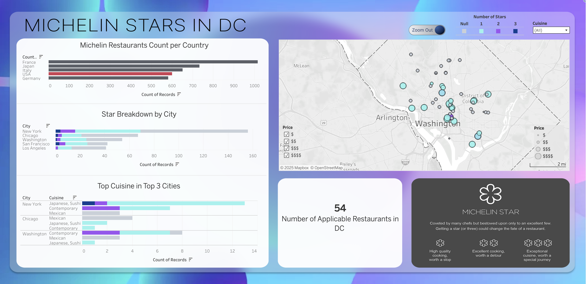

# ⭐ Michelin Stars in Washington, D.C.

**Author:** Erin Weiss  

## 🖼️ Dashboard Preview

[👉 **Click here to view the full interactive dashboard on GitHub Pages**](https://erin-weiss.github.io/tableau-DC-food-dashboard/)

---

## 📊 Project Overview

This Tableau dashboard provides an in-depth analysis of Michelin-starred restaurants in Washington, D.C., placing the city’s fine dining scene within a global and national context. The dashboard integrates **geographic, categorical, and numeric data** to explore how D.C. compares to other culinary hubs such as New York and Chicago, and to visualize restaurant distribution, cuisine trends, and Michelin star classifications.

---

## 🏁 About This Project

This project demonstrates my ability to:
- Design visually engaging and intuitive Tableau dashboards  
- Combine **data storytelling**, **geospatial analysis**, and **interactive design**  
- Enhance visualization aesthetics through **custom UI/UX design in Figma**

---

## 🧩 Features & Interactivity

- 🗺️ **Interactive Map** – Hover to view restaurant details (name, number of Michelin Stars, cuisine, price, website, accessibility).  
- ⚙️ **Filter Options** – Filter by cuisine type, price range, and number of stars.  
- 🔍 **Zoom Toggle** – A custom Figma-designed switch toggles between city and regional views.  
- 🎨 **Custom Design** – Dashboard background and UI elements were designed in **Figma** using *glassmorphism* techniques for a clean, modern look.

---

## 🧰 Technologies & Tools Used

- **Tableau** – Data visualization and dashboard creation  
- **Figma** – Custom background design and toggle switch UI  
- **Data Source** – [Michelin restaurant data (as of late 2023)](https://www.kaggle.com/datasets/ngshiheng/michelin-guide-restaurants-2021)
- **File Type:** Packaged Tableau Workbook (`.twbx`) 

---

## ⚙️ Project Details

- **Dataset**: Michelin-starred restaurants (2023)  
- **Region Focus**: Washington, D.C., with global and national comparisons  
- **Scope**: Exploratory data visualization  
- **Limitations**: Data not dynamically updated; reflects Michelin listings as of 2023

---

## 💡 Key Insights

- D.C. has **54** Michelin-rated restaurants, positioning it as a fast-rising culinary destination.  
- Fine dining in D.C. shows strong representation in **Contemporary** and **Japanese/Sushi** cuisines.  
- Michelin’s footprint remains most extensive in **France, Japan, and Italy**, underscoring its historical European focus.  
- **Central D.C.** dominates the city’s Michelin landscape, with limited suburban expansion.

---

## 🧠 Analysis & Commentary

Washington, D.C. is rapidly emerging as a **culinary hotspot**. While New York and Chicago still dominate the Michelin landscape, D.C.’s **54 starred restaurants** highlight its rising influence among fine-dining destinations.  

The dashboard’s visualizations provide a comprehensive narrative:

- **Michelin Restaurants Count per Country**  
  France, Japan, and Italy lead globally in Michelin-starred restaurants, followed by the U.S.—reflecting cultural and historical emphasis on fine dining in Europe and Japan.

- **Star Breakdown by City**  
  Among U.S. cities, New York remains the leader, followed by Chicago and Washington. D.C.’s growing number of starred establishments underscores its evolving status as a luxury dining hub.

- **Top Cuisine in Top 3 Cities**  
  Contemporary, Japanese/Sushi, and Mexican cuisines dominate across major cities, revealing a balance between culinary innovation and global influence.

- **Geographic Distribution of Michelin-Starred Restaurants in D.C.**  
  The interactive map shows that most Michelin-starred restaurants are clustered in central D.C., with a few extending into Arlington and the suburbs. Circle size represents price range, while color indicates the number of stars.

- **Total Starred Venues in D.C.**  
  The city boasts **54 Michelin-recognized establishments** as of 2023—an impressive figure given its size and relatively recent inclusion in the Michelin Guide.

- **Understanding Michelin Ratings**  
  The dashboard includes a visual explanation of Michelin stars—from one star (“worth a stop”) to three stars (“worth a special journey”)—highlighting the prestige of this rating system.

---

## 📁 Repository Contents

| File | Description |
|------|--------------|
| `Food-DC.twbx` | Packaged Tableau workbook |
| `dashboard-preview.png` | Static image preview for README |
| `README.md` | Project description and documentation |

---

## 🔗 Links

- **Live Dashboard**: [View on Tableau Public](https://public.tableau.com/views/Food-DC-Final/MichelinStarsinDCZoomIn?:language=en-US&:sid=&:redirect=auth&:display_count=n&:origin=viz_share_link) or [GitHub Pages](https://erin-weiss.github.io/tableau-DC-food-dashboard/)
- **Code & Assets**: [GitHub Repository](https://github.com/Erin-Weiss/tableau-DC-food-dashboard) 
- **Portfolio Page**: [View Project on Portfolio](https://erin-weiss.github.io/articles/Tableau-1.html)

---

*Created by [Erin Weiss](https://github.com/Erin-Weiss) — October 2025.*
