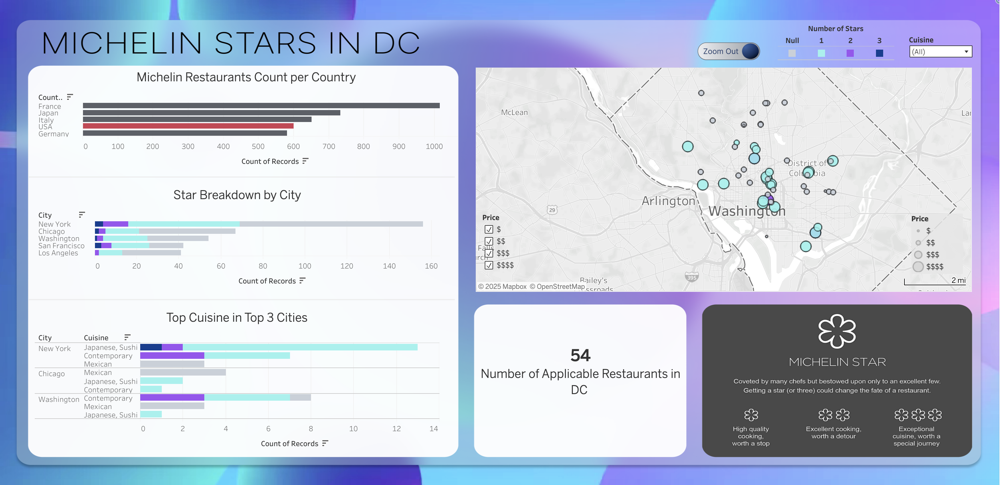

# Michelin Stars in Washington, D.C. — Interactive Tableau Dashboard

**Author:** Erin Weiss
[Portfolio](https://erin-weiss.github.io/index.html) | [LinkedIn](https://www.linkedin.com/in/erinweiss3/) | [GitHub](https://github.com/Erin-Weiss)

[View the Full Interactive Report](https://erin-weiss.github.io/articles/Tableau-1.html) | [Live GitHub Page](https://erin-weiss.github.io/tableau-DC-food-dashboard/)



---

## Objective

Design and build a visually polished, fully interactive Tableau dashboard that analyzes the distribution and characteristics of Michelin-starred restaurants in Washington, D.C. The project integrates geographic, categorical, and numeric data into a single cohesive view, combining custom Figma-designed UI elements, geospatial mapping with layered encodings, dynamic filtering, and comparative benchmarking across cities and countries. The techniques demonstrated here (interactive geospatial visualization, multi-level drill-down, and custom UI/UX design) are directly transferable to dashboards in any business domain.

---

## Dataset

| Property | Detail |
|----------|--------|
| Source | [Kaggle — Michelin Guide Restaurants 2021](https://www.kaggle.com/datasets/ngshiheng/michelin-guide-restaurants-2021) |
| Snapshot | Late 2023 Michelin listings |
| Scope | Global Michelin-starred restaurants, with regional focus on Washington, D.C. |
| Features | Restaurant name, star rating, cuisine type, price range, coordinates, accessibility, website |

---

## Methodology

1. **Data Acquisition & Cleaning** — Sourced Michelin restaurant data from Kaggle; filtered and prepared records for geographic and categorical analysis.
2. **Dashboard Design** — Custom-designed the dashboard background and UI toggle elements in **Figma** using glassmorphism techniques for a modern, polished aesthetic.
3. **Geographic Analysis** — Mapped D.C. Michelin-starred restaurants with circle size encoding price range and color encoding star classification; implemented a zoom toggle between city and regional (DMV) views.
4. **Comparative Benchmarking** — Constructed bar charts comparing Michelin restaurant counts across countries and U.S. cities to position D.C. within the broader culinary landscape.
5. **Cuisine Segmentation** — Analyzed dominant cuisine categories across the top three U.S. Michelin cities (New York, Chicago, Washington) to surface emerging culinary trends.
6. **Deployment** — Published the interactive dashboard to Tableau Public and embedded it on a custom HTML landing page hosted via GitHub Pages.

---

## Results

| Metric | Finding |
|--------|---------|
| D.C. Michelin-Rated Restaurants | 54 (as of 2023) |
| U.S. Ranking | 3rd behind New York and Chicago |
| Dominant Cuisines in D.C. | Contemporary, Japanese/Sushi |
| Geographic Pattern | Strong central-city clustering with limited suburban presence |
| Global Leaders | France, Japan, and Italy hold the highest Michelin restaurant counts worldwide |

**Key findings:**

- D.C. has 54 Michelin-recognized establishments as of 2023, ranking third among U.S. cities behind New York and Chicago, a notable figure given the city's relatively recent inclusion in the Michelin Guide.
- Contemporary and Japanese/Sushi cuisines are the most represented categories among D.C.'s Michelin-starred restaurants, a pattern that also holds across New York and Chicago.
- The majority of Michelin-starred restaurants are concentrated in central D.C., with only a few extending into Arlington and one located in the suburbs, as revealed by the zoomed-out DMV view.
- Globally, France, Japan, and Italy lead in Michelin restaurant counts by a wide margin, reflecting the guide's historical European and Japanese roots. The U.S. ranks fourth.


---

## Dashboard Features

- **Interactive Map** — Hover to view restaurant details including name, star count, cuisine, price, accessibility, and website link.
- **Dynamic Filters** — Filter by cuisine type, price range, and number of Michelin stars.
- **Zoom Toggle** — Custom Figma-designed toggle switches between a city-level and regional DMV view.
- **Custom UI/UX** — Dashboard background and toggle elements designed in Figma using glassmorphism techniques.
- **Professional Embedded Deployment** — The Tableau dashboard is embedded in a custom-built, responsive HTML page with glassmorphism styling, smooth animations, and viewport-adaptive sizing. The embed pattern is designed as a reusable template that can be adapted to deploy any Tableau Public dashboard as a polished standalone page.

---

## Tech Stack

| Category | Tool |
|----------|------|
| Visualization | `Tableau Desktop` / `Tableau Public` |
| UI/UX Design | `Figma` |
| Deployment | `GitHub Pages`, custom responsive `HTML/CSS` embed page |
| Data Source | Kaggle (`.csv`) |
| File Format | Packaged Tableau Workbook (`.twbx`) |

---

## Repository Structure

```
tableau-DC-food-dashboard/
├── Food-DC.twbx                  # Packaged Tableau workbook
├── dashboard-preview.png         # Static dashboard preview image
├── index.html                    # HTML landing page (GitHub Pages)
└── README.md
```

---

## How to Reproduce

```bash
git clone https://github.com/Erin-Weiss/tableau-DC-food-dashboard.git
cd tableau-DC-food-dashboard
```

Open `Food-DC.twbx` in Tableau Desktop to explore or modify the dashboard. The packaged workbook contains the embedded dataset and all worksheet/dashboard configurations. Alternatively, view the published version directly on [Tableau Public](https://public.tableau.com/views/Food-DC-Final/MichelinStarsinDCZoomIn).

---

## Future Work

- Automate data refresh with a pipeline that periodically pulls updated Michelin listings and re-publishes the dashboard.
- Incorporate customer review sentiment data (e.g., Google Reviews, Yelp) to enrich the analysis with demand-side signals.
- Extend geographic scope to additional U.S. metro areas for cross-market competitive analysis.
- Build a predictive model to identify neighborhoods with high potential for future Michelin-starred restaurant openings based on demographic and economic indicators.